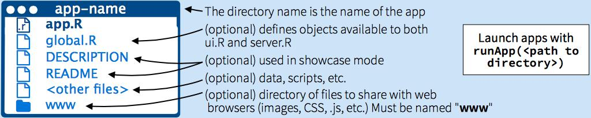
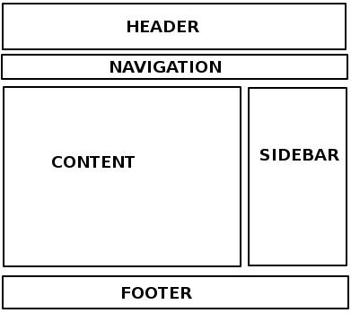
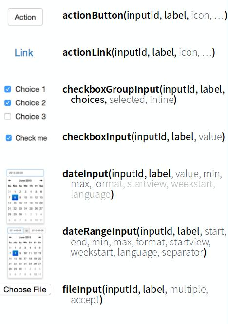
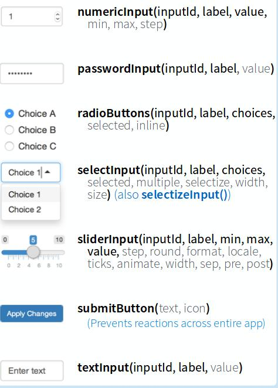
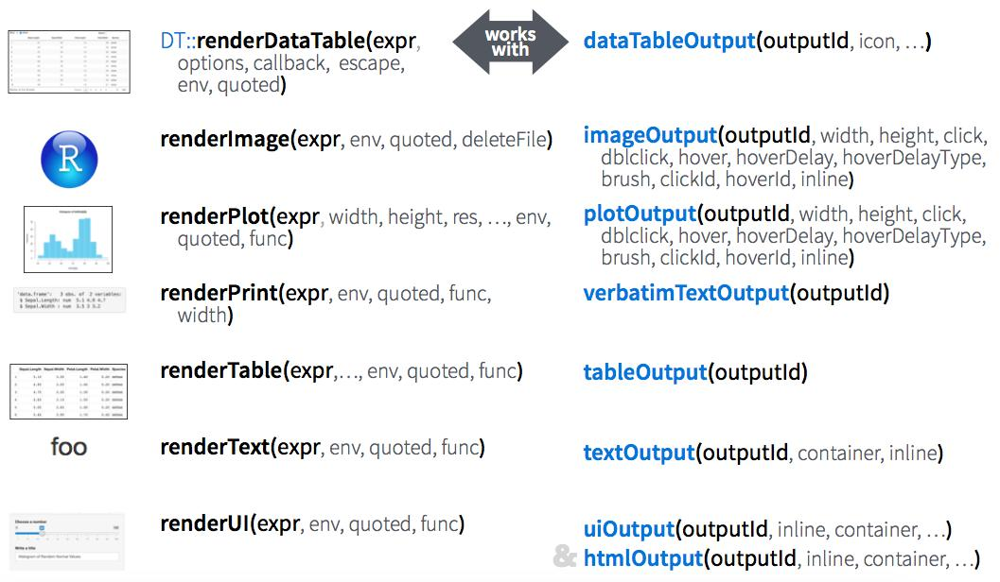
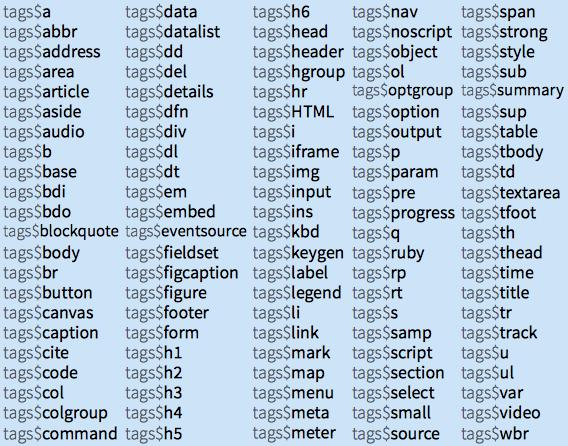
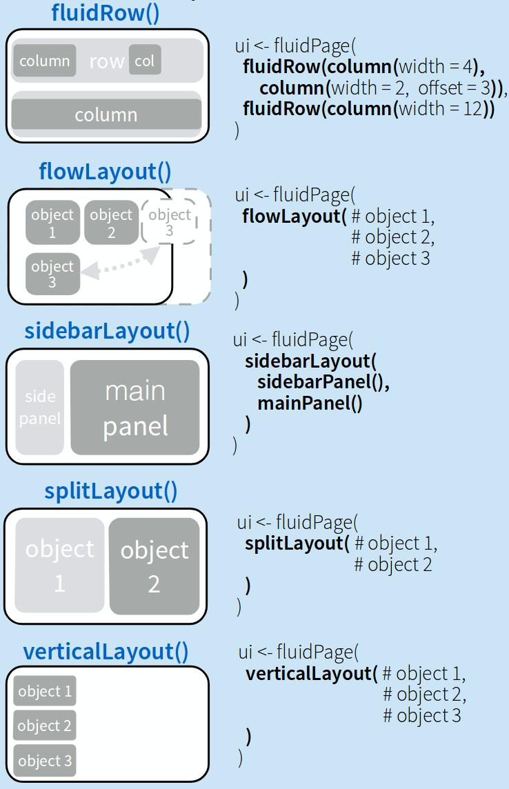

```{r setup, include=FALSE}
knitr::opts_chunk$set(echo = FALSE)
```

## Shiny Presentation

This R Markdown presentation is made interactive using Shiny. The viewers of the presentation can change the assumptions underlying what's presented and see the results immediately. 

To learn more, see [Interactive Documents](http://rmarkdown.rstudio.com/authoring_shiny.html).

## Outline

1. Introductory material
2. Basics of a Shiny app and UI framewok
3. Learn to build an app in Shiny 
4. Apps in the area of biostatistics & data science
5. References, citation and boring stuff so i wont get blamed for anything

## What usually happens in informatics

1. Data preparation
2. Modeling
3. Generate report
4. Something wrong in your data prep or model
5. Repeat 1 ~ 4

## The Problem

- Biostatisticians use R for their analysis

- Biologists want to see the analysis without having to know R issues beforehand

- Biostatistician converts their data into a static format that is presentable
- If something goes wrong, or if additional questions arise, Biostatistician has to repeat the code over
- Biologist tries to use R code without the experience, runs into issues
- Biostatistician uses unfamillar code, runs into issues

## The Motivation

- Create an interface straight from R code. 
- Be able to generate plots and figures instantaneously

## The Solution
- R Shiny = R + interactivity + web made easy
- In words: Open source R package from Rstudio that creates interactive web applications around your R analyses and visualizations
- No HTML/CSS/Javascript knowledge required to implement ...
- .... but fully customizable and extensible with HTML/CSS/JavaScript

## Introduction to shiny
- What’s a Shiny App?
- A Shiny app is a web page (UI) connected to a computer/server running a live R session (Server)
- Users can manipulate the UI, which will cause the server to update the UIs displays (by running R code)

## Shiny basics

###There are two main components of a Shiny app
- The `ui` , or user interface, which designs the layout of the app
- The `server` , which operates your R code


## Shiny basics

###There are two approaches for organizing Shiny app
- Using one script, `app.R` , which contains two variables, `ui` and `server` , for defining these components and ends with the `shinyApp(ui, server)` function
- Save each app as a directory that contains an app.R file (or a ui.R file and a server.R file) plus optional extra files


## Shiny basics
- Alternatively, split template into two files named ui.R and server.R:
- ui.R: `fluidPage()`
- server.R: `function(input, output)`
- Remark: No need to call `shinyApp()`
- Using two separate scripts, `ui.R` and `server.R` , for defining the user interface and server operations. The app can be run using the `runApp()` function, or with the “Run App” button in RStudio


## Example - Code {.smaller}
```
 ui<-fluidPage( 
numericInput(inputId='n',
'Samplesize',value=25)
,plotOutput(outputId='hist'))

 server<-function(input,
output){
output$hist<-renderPlot({
hist(rnorm(input$n))
})}

shinyApp(ui=ui,server=server)
```
## Example - Result {.smaller}
```{r, echo = TRUE, fig.width=8}
 ui<-fluidPage( 
numericInput(inputId='n',
'Samplesize',value=25)
,plotOutput(outputId='hist'))

 server<-function(input,
output){
output$hist<-renderPlot({
hist(rnorm(input$n))
})}

shinyApp(ui=ui,server=server)
```

## The User Interface (UI)
<div class="columns-2">
- Designing the layout of the app
- Defining the Input variables
- Displaying the Output from the server



</div>


## Inputs
```
ui<-fluidPage(
 
numericInput(inputId='n','Samplesize',value=25)

,plotOutput(outputId='hist'))

```
- Input values are reactive
- Access the current value of an input object with `input$<inputid>`

## Inputs
<div class="columns-2">




</div>

## Outputs
```
ui<-fluidPage(numericInput(inputId='n','Samplesize',value=25)

,plotOutput(outputId='hist'))

```
- Adds R output to interface
- Access the output from a server output object with `output$<outputid>`
- `render*()` and `*Output()` functions work together to generate visuals

## Outputs


## HTML tags
- shiny output supports HTML tags
- Static HTML elements can be added with tags, a list of functions that parallel
common HTML tag



## HTML tags
```
 ui<-fluidPage( 
tags$h1("This is an example app"),
tags$hr(),
tags$br(),
tags$p(strong("Tyrone Lee")),
tags$p(em("Data Analyst and R guru")),
tags$a(href="https://whoi.whoi-it.edu","whoi"))

 server<-function(input,
output){
output$hist<-renderPlot({
hist(rnorm(input$n))
})}

shinyApp(ui=ui,server=server)
```

## Panels
- Combine multiple elements into a ”single element” that has its own properties with a
panel function

## Panels  {.smaller}
<div class="columns-2">
```{r, echo = TRUE}

library(shiny)
ui<-fluidPage(
wellPanel(
numericInput(inputId="n",
"Samplesize",value=25),
submitButton()),
plotOutput(outputId="hist"))

server<-function(input,output){
output$hist<-renderPlot({
hist(rnorm(input$n))
})}

shinyApp(ui=ui,server=server)

```
</div>
## Panels
-<div class="columns-2">




</div>


##Step By step tutorial in shiny
- With basic funcionality covered...
- We will build a series of apps to show the functionality and reactivity achieved through shiny

## App1
- Create a simple app that displays text within the title panel, sidebar panel and
main panel, where the sidebar panel is located on the right

## App2
- Extend App 1 by displaying a box plot from random generating normal distributed
data in the main panel. Number of datapoints can be chosen apriori by the user in
the sidebar panel (located at the left).

## App3
- Extend App 2 by adding the possibility to choose your own title within a text input
and color of the box plot with a radio button (in the sidebar panel). Additionally,
a submit button needs to be present that only updates the main panel with a click.

## App4
- Analyze the iris dataset by making a box plot of every numeric variable (i.e.,
Sepal.Length, Sepal.Width, Petal.Length, Petal.Width) per species. Summarize these
box plots into one figure. Different slider inputs need to be used for choosing your
own subset of data.

## App4
```

library(ggplot2)
library(gridExtra)

ui<-fluidPage(
  titlePanel(title="Fourthapp..."),
  sidebarLayout(
    sidebarPanel(sliderInput(inputId="sepallength",
                             "Sepal.Length:",min=4.3,max=7.9,
                             value=5.8,step=0.1),
                 sliderInput(inputId="sepalwidth",
                             "Sepal.Width:",min=2,max=4.4,
                             value=3,step=0.1),
                 sliderInput(inputId="petallength",
                             "Petal.Length:",min=1,max=6.9,
                             value=c(1.6,5.1)),
                 sliderInput(inputId="petalwidth",
                             "Petal.Width:",min=0.1,max=2.5,
                             value=1.3,step=0.3),
                             animate=animationOptions(
                               interval=2600,loop=TRUE)), mainPanel(
                                 plotOutput(outputId = "box") 
                                 )
                 )
    )
server<-function(input,output){
  output$box<-renderPlot({
    sepall<-subset(iris,Sepal.Length>=4.3
                   &Sepal.Length<input$sepallength,
                   select=c(Sepal.Length,Species))
    sepalw<-subset(iris,Sepal.Width>=2
                   &Sepal.Width<input$sepalwidth,
                   select=c(Sepal.Width,Species))
    petall<-subset(iris,Petal.Length>=
                     input$petallength[1]&Petal.Length
                   <input$petallength[2],
                   select=c(Petal.Length,Species))
    petalw<-subset(iris,Petal.Width>=0.1
                   &Petal.Width<input$petalwidth,
                   select=c(Petal.Width,Species))
    test<-ggplot(sepall,aes(x=Species,
                            y=Sepal.Length))+geom_boxplot()

    testb<-ggplot(sepalw,aes(x=Species,
                             y=Sepal.Width))+geom_boxplot()
    testc<-ggplot(petall,aes(x=Species,
                             y=Petal.Length))+geom_boxplot()

    testd<-ggplot(petalw,aes(x=Species,
                             y=Petal.Width))+geom_boxplot()
    grid.arrange(test,testb,testc,testd,nrow=1)
  })}

shinyApp(ui=ui,server=server)

```

## Applications at WHOI
- Can I show Ben's Stuff here?


## references and thanks
- Etc. etc